# 个人网站

一个现代化的个人网站，使用 React + Spring Boot + Java 21 构建。

## 技术栈

### 前端
- React 18
- Vite
- TailwindCSS
- Framer Motion
- React Router

### 后端
- Java 21
- Spring Boot 3.2
- Spring Security
- JWT Authentication
- MySQL 8.4

## 快速开始

### 前置要求
- Java 21+
- Node.js 18+
- Maven 3.8+
- MySQL 8.0+

### 一键启动

**Windows:**
```bash
start.bat
```

**Linux/Mac:**
```bash
chmod +x start.sh
./start.sh
```

### 手动启动

1. 启动后端：
```bash
cd backend
mvn spring-boot:run
```

2. 启动前端：
```bash
cd frontend
npm install
npm run dev
```

## 访问地址

- 前端展示页: http://localhost:3000
- 管理后台: http://localhost:3000/admin
- 后端 API: http://localhost:8080

## 默认账号

- 用户名: `admin`
- 密码: `admin123`

## 截图预览

### 个人主页

<p align="center">
  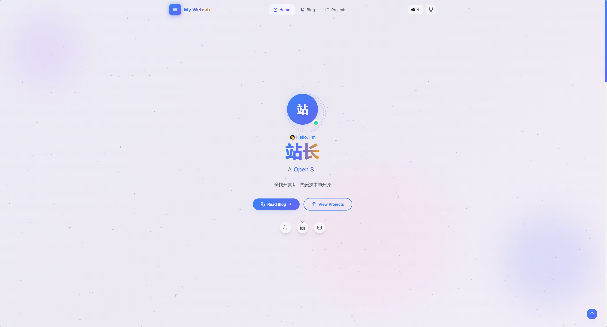
</p>

<p align="center">
  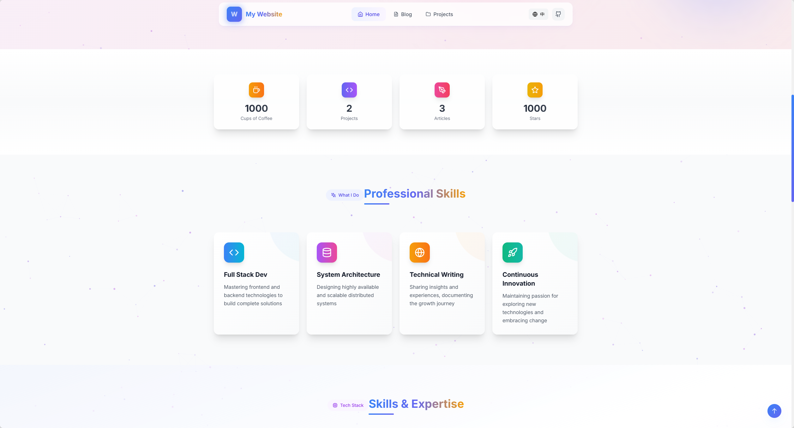
</p>

<p align="center">
  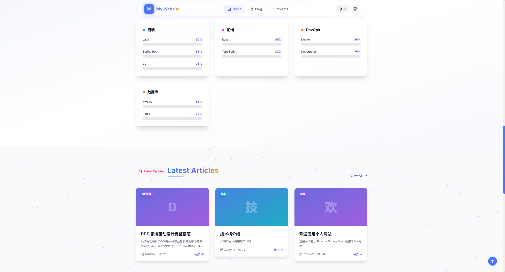
</p>

<p align="center">
  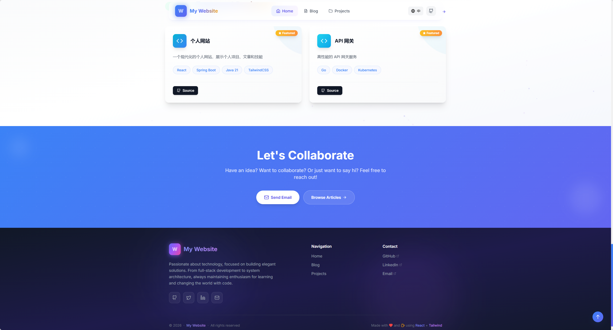
</p>

### 博客与项目

<p align="center">
  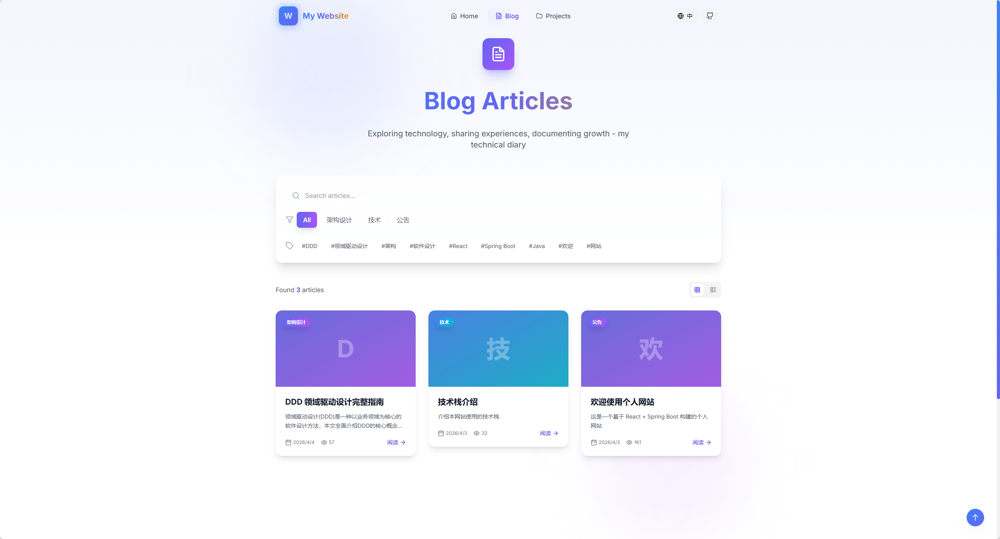
</p>

<p align="center">
  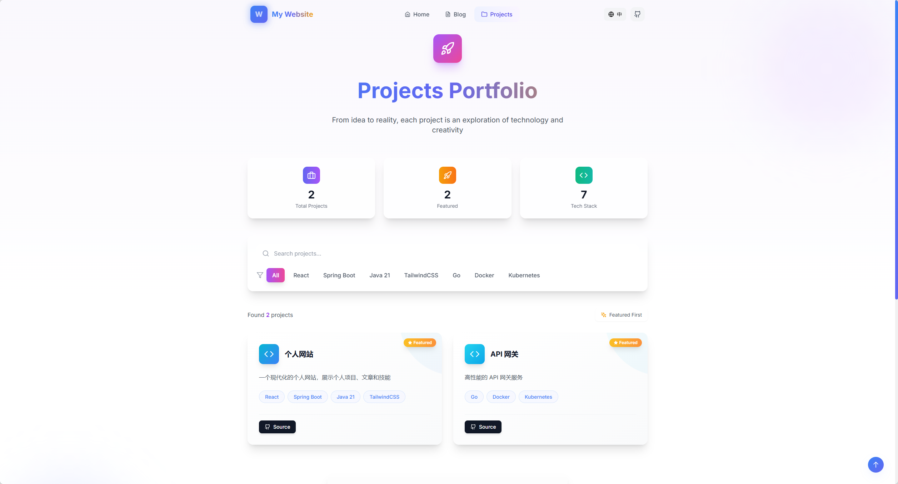
</p>

### 管理后台

<p align="center">
  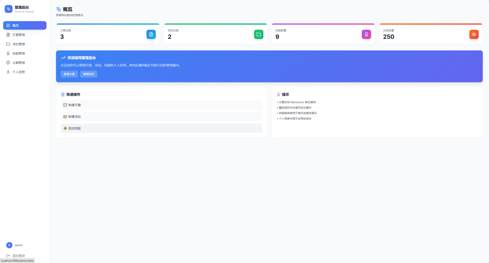
</p>

<p align="center">
  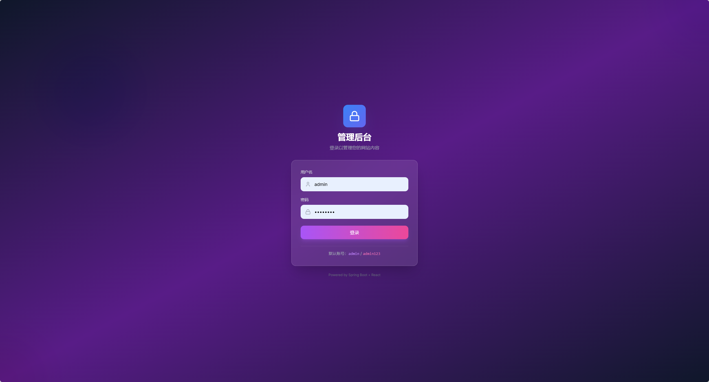
</p>

<p align="center">
  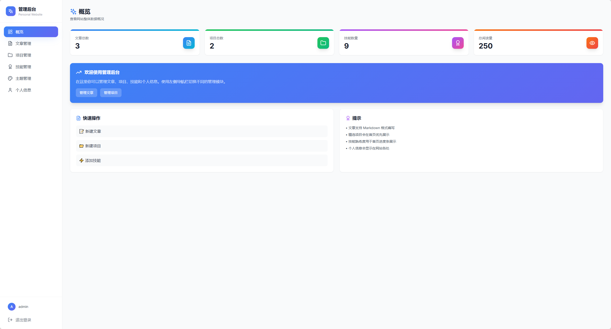
</p>

<p align="center">
  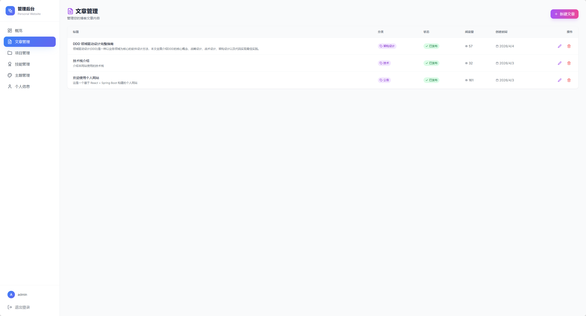
</p>

<p align="center">
  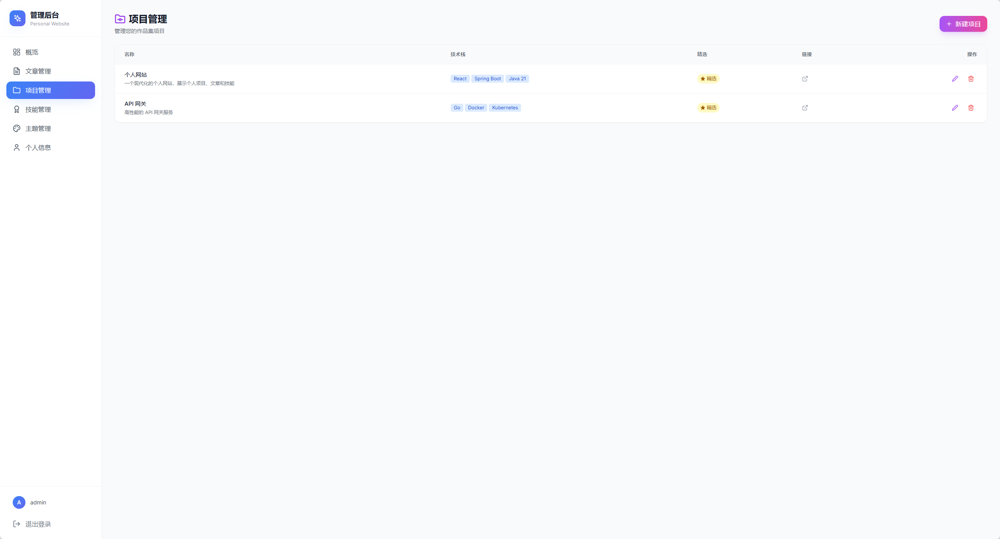
</p>

<p align="center">
  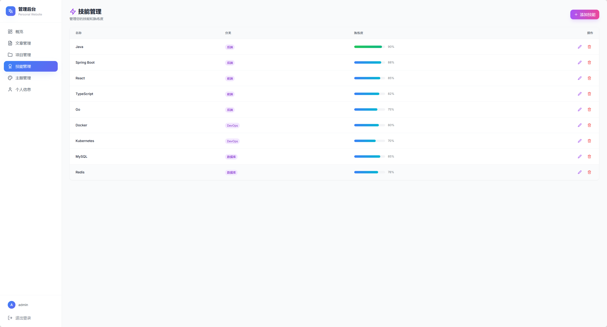
</p>

<p align="center">
  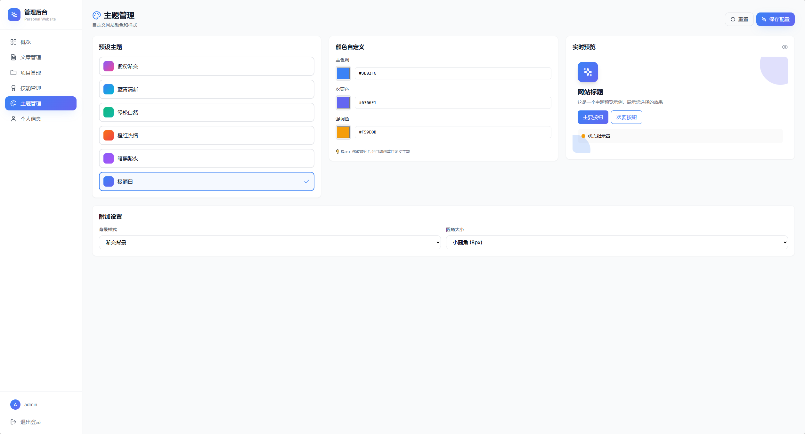
</p>

<p align="center">
  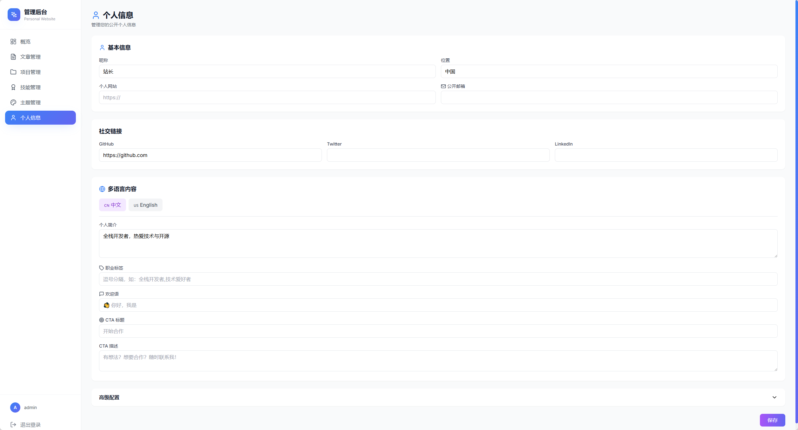
</p>

---

## 功能特性

### 用户端
- 🏠 首页展示（个人简介、技能、精选项目）
- 📝 博客文章（支持 Markdown）
- 💼 项目展示
- 🔍 响应式设计

### 管理后台
- 📊 数据概览
- 📝 文章管理（增删改查）
- 💼 项目管理
- 🛠️ 技能管理
- 👤 个人信息管理

## 项目结构

```
personal-website/
├── backend/                # Spring Boot 后端
├── frontend/               # React 前端
├── docs/                   # 文档与截图
│   └── screenshots/        # 页面截图预览
├── docker/                 # Docker 配置文件
│   ├── nginx.conf          # Nginx 配置
│   └── supervisord.conf    # Supervisor 配置
├── start.bat              # Windows 启动脚本
├── start-full.bat         # Windows 完整启动脚本
├── start.sh               # Linux/Mac 启动脚本
├── Dockerfile             # Docker 镜像构建文件
├── docker-compose.yml     # Docker Compose 配置
├── .dockerignore          # Docker 构建忽略文件
└── README.md
```

## 数据库

使用 **MySQL 8.4** 作为持久化数据库，请确保 MySQL 服务已启动并创建对应数据库。

### 数据库配置

修改 `backend/src/main/resources/application.yml`：

```yaml
spring:
  datasource:
    url: jdbc:mysql://localhost:3306/personal_website?useSSL=false&serverTimezone=Asia/Shanghai&characterEncoding=utf-8
    username: root
    password: your_password
  jpa:
    hibernate:
      ddl-auto: update
```

首次启动会自动创建数据表。

## Docker 部署

### 一键启动 (推荐)

```bash
# 构建并启动
docker-compose up -d --build

# 查看日志
docker-compose logs -f

# 停止服务
docker-compose down
```

### 访问地址

- 前端展示页: http://localhost
- 后端 API: http://localhost:8080
- 管理后台: http://localhost/admin

### Docker 架构说明

容器内使用 Supervisor 管理两个进程：
- **Nginx**: 服务前端静态文件，代理后端 API (端口 80)
- **Spring Boot**: 后端服务 (端口 8080)

### 数据持久化

- `./logs`: 应用日志
- MySQL 数据库：数据持久存储在 MySQL 服务器中

### 手动构建镜像

```bash
docker build -t personal-website:latest .
docker run -d -p 80:80 -p 8080:8080 -v ./data:/app/data personal-website:latest
```

## 自定义配置

修改 `backend/src/main/resources/application.yml`:

```yaml
server:
  port: 8080

spring:
  datasource:
    url: jdbc:mysql://localhost:3306/personal_website?useSSL=false&serverTimezone=Asia/Shanghai&characterEncoding=utf-8
    username: root
    password: your_password
  jpa:
    hibernate:
      ddl-auto: update
```

## 许可证

MIT License
